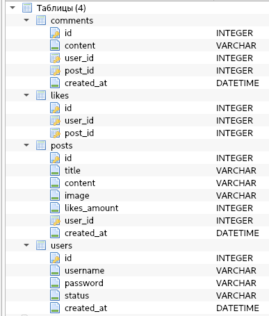
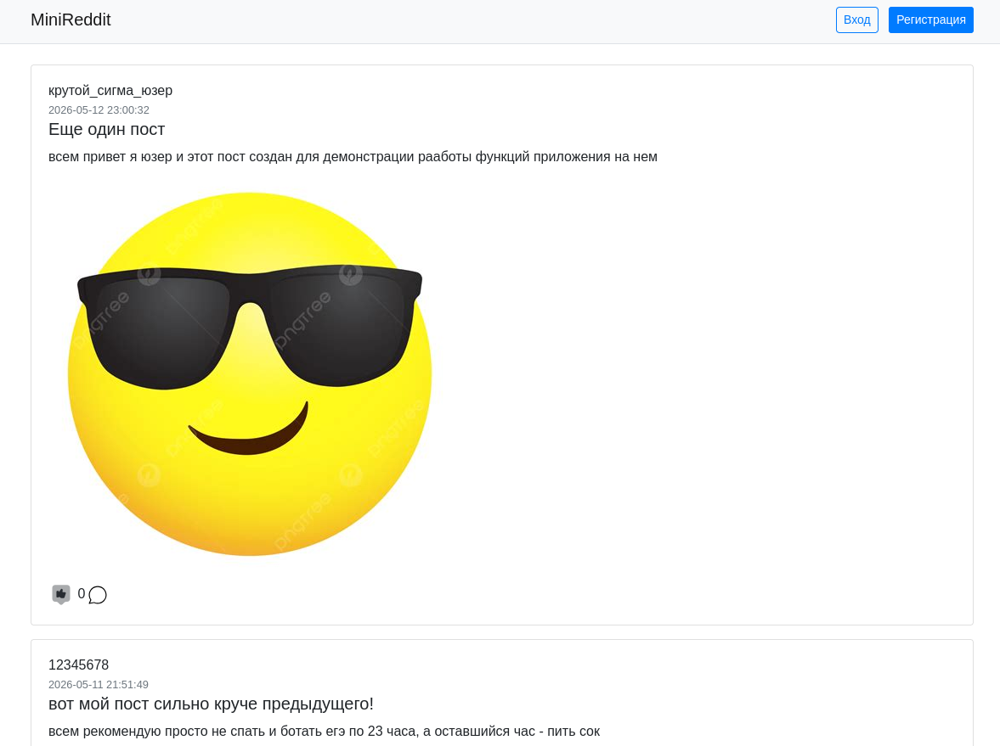
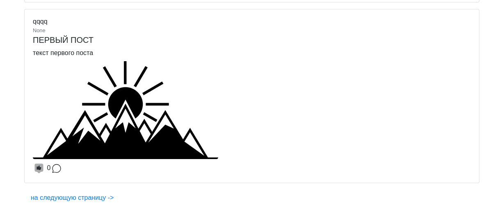
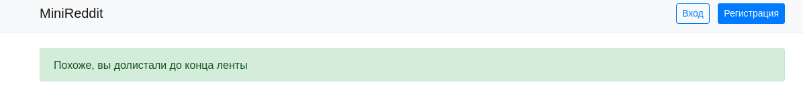
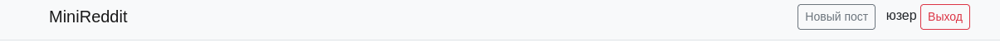
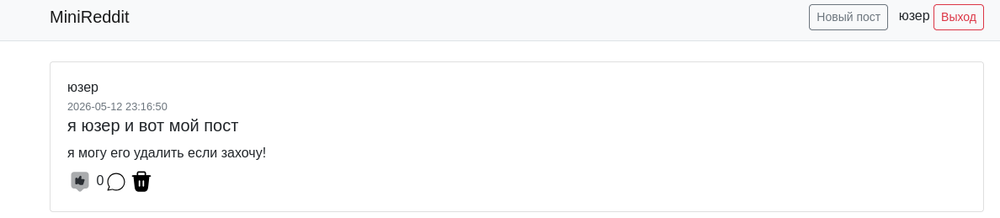
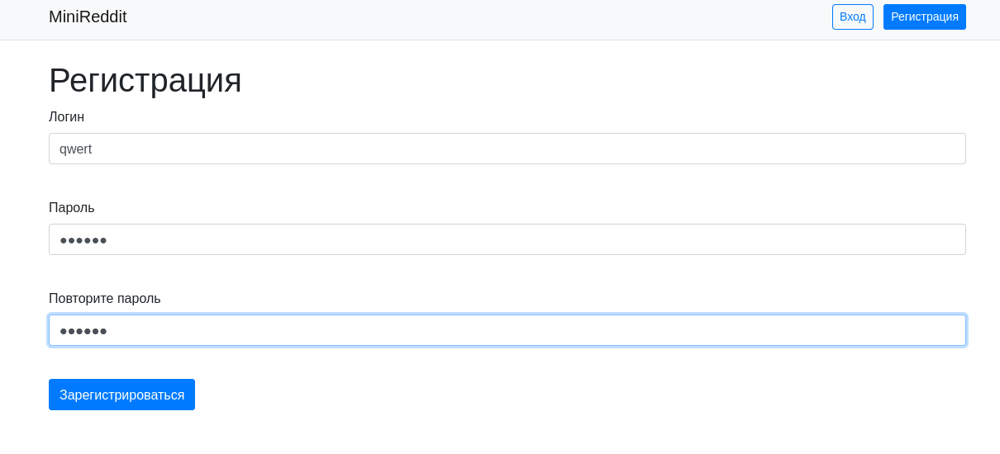
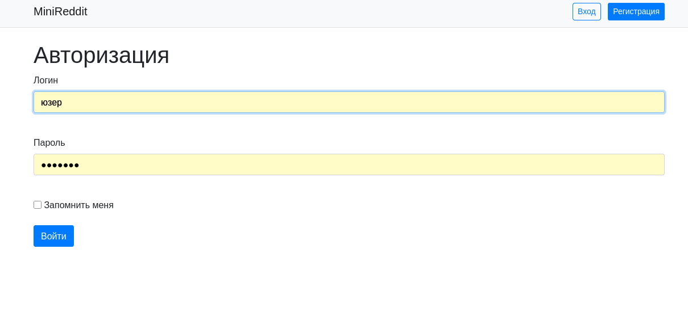
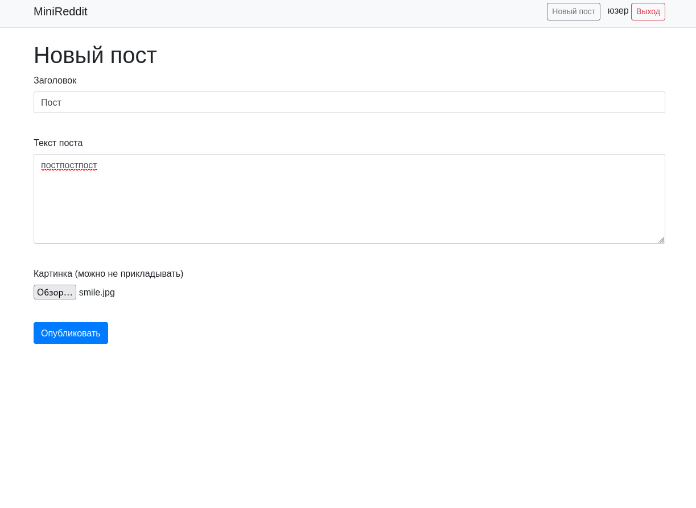

# Пояснительная записка

## MiniReddit

MiniReddit - онлайн-форум, на котором пользователи могут
размещать посты, комментировать их и голосовать за понравившиеся

---

### База данных

---

### Главное окно

На главном окне отображаются все посты, а также кнопки "Вход"
и "Регистрация", которые ведут на окна входа и регистрации соответственно

Если пользователь доходит до конца страницы,
он может перейти на следующую страницу, нажав на кнопку
"на следующую страницу->"

Долистав до конца ленты, пользователь видит следующее уведомление

Зарегистрированный пользователь видит кнопки "Создать пост" и "Выход"

Под каждым постом находятся кнопки "лайк" и "комментарий", а также отображается количество лайков.
Ставить лайки и комментировать могут только зарегистрированные пользователи.
Также, около своих постов и комментариев пользователи видят кнопку "Удалить".
Админы могут удалять все посты

Если пользователь ставит лайк посту, картинка лайка становится закрашенной

---

### Окна регистрации и входа в аккаунт

---

### Окно детального просмотра поста

На окне отображаются все комментарии к посту

Зарегистрированный пользователь может написать или удалить свой комментарий.
Админ может удалить комментарии любого пользователя.

### Окно создания поста

Пользователь должен написать заголовок и текст поста, а также может приложить
картинку, если захочет.

### API
С помощью апи админ может получить список всех постов,
а также удалить любой пост. Внутри приложения используется flask-RESTful
#### Для админов:

- /api/posts
- /api/delete_post/int:post_id
- /api/delete_comment/int:comment_id

#### Для зарегистрированных пользователей:

- /api/posts/int:post_id
- /api/delete_post/int:post_id (только свой пост)
- /api/like/int:post_id
- /api/remove_like/int:post_id
- /api/check_like/int:post_id
- /api/delete_comment/int:comment_id (только свой комментарий) 